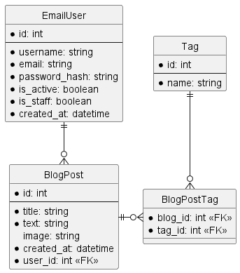

# TriFrameBlog

This project serves as aid for Diploma thesis: Comparison of Python Web Frameworks.

## Compared Frameworks

There are three python web frameworks used. Each of them implements the same [application](#blog-app) in their own respective sub-project. The following frameworks are used:

- Django - code is located in django_blog
- Flask - code is located in flask_blog
- FastAPI - code is located in fastapi_blog

Shared functionality is found under the shared folder.

## Blog App

A simple blog web application implemented by the three frameworks.

### Functional requirements

- Users can register with an email, and password.
- Users can set their username on their profile.
- Users can log in using their email and password.
- All users can view list of blogs.
- All users can view the detail page of a blog.
- Authenticated users can create, update, and delete blogs.
- Blogs can have various tags.
- Blogs can be filtered by tags or searched by title.

### Non-functional requirements

- The application should have a straightforward navigation for operations.
- The application should validate inputs.
- Passwords must be hashed and securely stored.
- Code should be modular and well-documented.

### Design

This is the base ER diagram that all implementations should fulfill. However, tables related to authentication might vary based on the framework.

#### Wireframes

